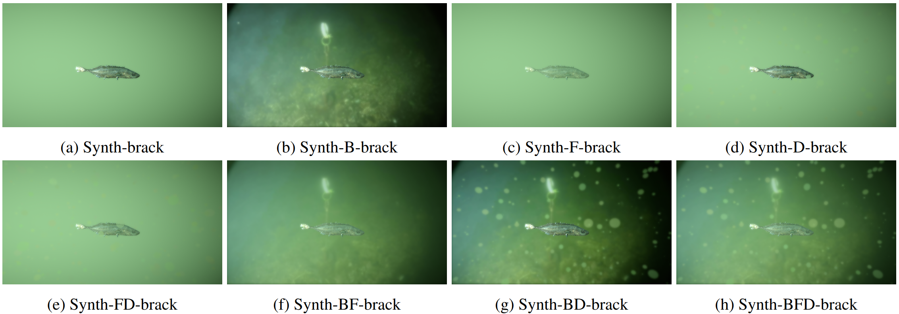

## Underwater-Fish-Environment
 TODO: 
- SpawnerBoids.cs -> Replace X with L
- ADD zip with video background
- Add download link for the data

# Overview
This repository contains Unity project for generating synthetic MOT underwater data. The data can be generated in 8 different environmental conditions, presented bellow. The repository is affiliated with the following project - XXX (link here). Generated data can be downloaded from XXX (link here).

(a) Plain background, no fog, no distractors. (b) Video background, no fog, no distractors. (c) Plain background, fog, no distractors. (d) Plain background, no fog, with distractors. (e) Plain background, with fog and distractors. (f) Video background with fog, but without distractors. (g) Video
background with distractor, but without fog. (h) Video background with fog and distractors.
 
# How to use
Tested on Ubuntu 22.04, Unity Editor XXX. To install Unity Hub on Ubuntu 22.04, follow this guide - https://dev.to/brenomfviana/my-experience-using-unity3d-on-manjaro-i3-40ad.

 
# High-level flowchart and important functions

## void generateControlList()
Creates a list of environmental conditions to be used for data generation. Here you can define if you want to use fog, distractors, and a plain or a video background. The data generator runs until all sequences for all defined environment conditions are generated. For every environmental condition defined, 50 sequence are generated, with every sequence containing 150 annotated images.  

## void setupFolderStructure()
Creates a root folder named after the environmental conditions used. New root folder is created for every entry in the control list generated by the _generateControlList()_.

## void randomizeVideo()
If a video background is enabled, a random video from the _Assets/Video_ folder is selected as the background. 

## void generateFogColor()
Generates a new fog color. If a plain background is used, the fog color is also used as a background color. If fog is enabled, the fog color is generated here. 

## void randomizeFog()
If a fog is enabled, fog color is set to the color generated by _generateFogColor()_ and fog intensity is randomly decided. 

## void generateDistractors()
If distractors are enabled, this function spawns a random number of distractors in randomized poses within the camera view. For each distractor, its material properties and scale are randomized. 

## void getNewBoidParameters()
Randomizes boid behaviour parameters.

## void instantiateFish()
Spawns fish. Fish parameters are randomized here. 

## void addNewSequence()
If a goal number of images is achieved, in our case 150 images, a new sequence is started. Fundamentally, this function sets up a required folder structure within a root folder generated by _setupFolderStructure()_ and resets image counter to 0. 

## void simulateMovement(List\<boidController> boids, float time)
This function encapsulates all functionality related to the fish motion - both the boid-based and random behaviour. 

## void updateDistractors()
If distractors are enabled, this function randomizes their poses every image.   

## boundingBox GetBoundingBoxInCamera(GameObject go, Camera cam)
Calculates a bounding box of a game object _go_ based on the camera view of _cam_ using the vertices of the game object _go_. 

## void SaveAnnotation(boundingBox bbox, int go_id)
Saves image annotation in the comma-separated ground truth text file in the following format - _<frame\>, <id\>, <left\>, <top\>, <width\>, <height\>, <confidence\>, <class\>, <visibility\>_.

## void SaveCameraView()
Saves RGB image as _.jpg_. Images are rendered straight into a 2D texture with dimensions _960x544_ and saved. This can cause some game view shenanigans, that can be safely ignored.  

## void CleanUp()
Resets/Clears sequence variables. 

# Overview of randomized parameters 
|**Fish**                            |                     ######                                                         | Data type/Unity encoding  |
|:----------------------------------:|:----------------------------------------------------------------------------------:|---------------------------|
| Number of fish                     |                                       <4, 50>                                      | int                       |
| Initial fish position              |                             [<0, 1>, <0, 1>, <20, 60>]                             | Camera viewport encoding  |
| Initial fish rotation              |                                 [0, <-180, 180>, 0]                                | RPY encoding              |
| Fish scale                         |                                [1, 1, 1] * <0.5, 1>                                | Vector3                   |
| Fish material - Albedo             |                             [[1, 1, 1] * <75, 225>, 1]                             | RGBA encoding             |
| Fish material - Metalic            |                                     <0.1, 0.5>                                     | float                     |
| Fish material - Metalic\Glossiness |                                     <0.1, 0.5>                                     | float                     |
|         **Boid behaviour**         |                                     ######                                         |       ######              |
| K                                  |                                    <0.75, 1.25>                                    | float                     |
| S                                  |                                    <0.75, 1.25>                                    | float                     |
| M                                  |                                    <0.75, 1.25>                                    | float                     |
| L                                  |                                    <0.75, 1.25>                                    | float                     |
| No clumping area                   |                                     <7.5, 12.5>                                    | float                     |
| Local area                         |                                      <15, 25>                                      | float                     |
| Random direction                   |                             [<-1, 1>, <-1, 1>, <-1, 1>]                            | Vector3                   |
| Random weight                      |                                       <1, 10>                                      | float                     |
|           **Environment**          |                            ######                                                  |          ######           |
| Video background                   |                       <background_1.mp4, background_152.mp4>                       | NA                        |
| Fog/Plain background colour        | [<171, 191>, <192, 212>, <137, 157>, <151, 171>]  OR [[1, 1, 1] * <75, 225>, 1] | RGBA colour encoding      |
| Fog intensity                      |                                     <0.1, 0.8>                                     | float                     |
| Number of distractors              |                                      <50, 500>                                     | int                       |
| Initial distractor position        |                             [<0, 1>, <0, 1>, <10, 50>]                             | Camera viewport encoding  |
| Distractor scale                   |                                [1, 1, 1] * <0.01, 1>                               | Vector3                   |
| Distractor material - Albedo       |                 [<171, 191>, <192, 212>, <137, 157>, <151,   171>]                 | RGBA colour encoding      |
| Distractor material - Transparency |                                       <0, 1>                                       | float                     |

# Contact information
Daniel Lehotsky,  
Research assistant,  
Visual Analysis and Perception,  
Aalborg University
